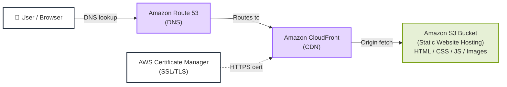

# S3 Static Website Hosting Architecture (Mermaid)

## Components

| Component | Role |
|-----------|------|
| **User / Browser** | End user accessing the website over HTTPS |
| **Amazon Route 53** | DNS resolution; maps the custom domain to CloudFront |
| **Amazon CloudFront** | Global CDN that caches and accelerates content delivery; terminates HTTPS |
| **AWS Certificate Manager (ACM)** | Provisions and manages the SSL/TLS certificate for CloudFront |
| **Amazon S3 Bucket** | Origin storing static assets (HTML / CSS / JS / images) |

## Request Flow

1. **DNS lookup** — The user enters the domain; Route 53 resolves it.
2. **Routes to CDN** — The request is routed to the nearest CloudFront edge location.
3. **Origin fetch** — On a cache miss, CloudFront fetches the static files from the S3 bucket.
4. **HTTPS** — The ACM certificate is attached to CloudFront, securing the connection.
